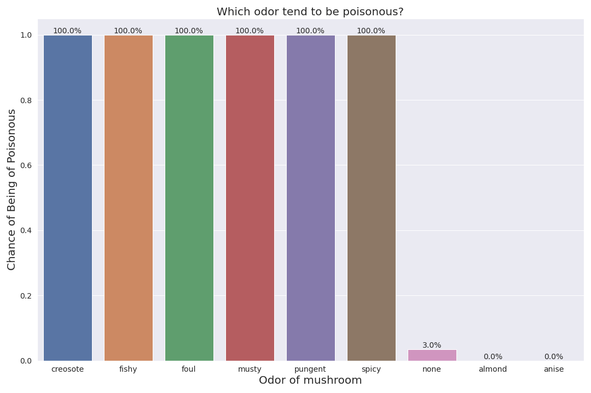

# Classification-of-Edible-and-Poisonous-Mushrooms 
## Making and Tuning a Model for Production
**Guy Lozius**:

### Business problem:
The goal is to create a model that is efficient at determining if a mushroom is edible or poisonous, and then recommend it for production and the stakeholder.  
### Data:
Dataset source: (https://www.kaggle.com/datasets/uciml/mushroom-classification) 
Dataset Description: 
The dataset is made of synthetic samples corresponding to 23 species of gilled mushrooms in the Agaricus and Lepiota Family Mushroom. Each species is either edible or poisonous. 

| Columns                  | Description                               | Values                                                                               |
|--------------------------|-------------------------------------------|--------------------------------------------------------------------------------------|
| Classes                  | If the mushrooms are edible or poisonous. |  edible, poisonous                                                                   |
| cap-shape                | The Cap shape of mushroom.                | Bell, conical, convex, flat, knobbed, sunken                                         |
| cap-surface              | The texture of the mushroom cap.          | Fibrous, grooves ,scaly, smooth                                                      |
| cap-color                | The color of the mushroom cap.            | Brown, buff, cinnamon, gray, green, pink, purple ,red,white, yellow                  |
| bruises                  | If the mushroom has bruises or not.       | Bruises, No-Bruises                                                                  |
| Odor                     | The odor of the mushroom.                 | Almond, anise, creosote, fishy,  foul, musty,  none, pungent, spicy                  |
| Gill-Attachment:         | The Gill attachment states of mushroom.   | Attached,descending,free,notched=n                                                   |
| Gill-spacing             | The spacing between the gills.            | Close, Crowded, Distant                                                              |
| Gill-size                | The gill size of mushroom.                | Broad, Narrow                                                                        |
| Gill-color:              | The color of gill.                        | Black, brown, buff, chocolate, gray, green, orange, pink, purple, red, white, yellow |
| Stalk-shape              | The stem shape of a mushroom.             | Enlarging, tapering                                                                  |
| stalk-root:              | The type of root the mushroom has.        | Bulbous, club, cup, equal, rhizomorphs                                               |
| stalk-surface-above-ring | Texture of the ring above the stalk .     | Fibrous, scaly, silky, smooth                                                        |
| stalk-surface-below-ring | Texture of the ring below the stalk.      | Fibrous, scaly, silky, smooth                                                        |
| stalk-color-above-ring:  | Color of the ring above the stalk .       | Brown, buff, cinnamon, gray, orange, pink, red, white, yellow.                       |
| stalk-color-below-ring:  | Color of the ring below the stalk .       | Brown, buff, cinnamon, gray, orange, pink, red, white, yellow.                       |
| Veil_type:               | Veil type of mushroom                     | partial,universal                                                                    |
| Veil-color               | Color of the veil                         | Brown, orange, white, yellow                                                         |
| ring-number:             | The number of ring                        | None, One, Two                                                                       |
| ring-type:               | The type of ring                          | Cobwebby,Evanescent, Flaring, large, none, pendant, sheathing, zone                  |
| spore-print-color:       | The color print from spore.               | Black, brown, buff, chocolate, green, orange, purple, white, yellow                  |
| population:              | How many mushrooms grows.                 | Abundant, clustered, numerous, scattered, several, solitary.                         |
| habitat:                 | The type places the mushroom grows at.    | Grasses, leaves, meadows, paths, urban, waste, woods                                 |
### Methods:
- Clean data
- Simply exploratory  
- Visual exploratory 
- Create models
- Baseline evaluation 
- Implement Principal component analysis  to increase speed 
- Re-evaluation   
- Tune Models
- Re-evaluation  
- Compare models
- Recommend the best 
-Justify recommendation 
## Results
### Trends 

Bad and spicy smelling mushroom tend to be poisonous.

Buff, yellow, pink, and red have a higher chance of being Poisonous. 
## Info on Final Model
The model I picked for "production" is a LogisticRegression for classification of poisonous and edible mushrooms  
and that was hyperparameter tuned and preprocessed with the Principal Component Analysis algorithm to increase performance.
## The model Recommendation.
The model it is fastest and it can determine if a mushroom is edible or poisonous with 100% precision.
The only problem is that dataset is made with synthetic mushroom base on average, so I do not know how it will fare against real mushrooms.
## Conclusion
In Conclusion, The goal is to make the optimal model to determine if a mushroom is poisonous  or edible based on a synthetic mushroom dataset. The final model was fastest and had accuracy of hundred percent, but because the dataset is based on a hypothetical  dataset. I can not fully support putting it in production because I don’t know how it will fare with real mushrooms.
